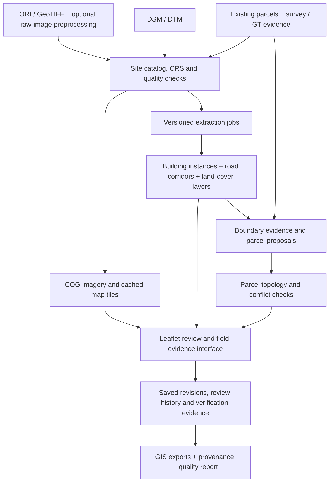

# SIH26012: five remaining development phases

Version 1.0 · 5 October 2026 · Planning baseline: commit `acab8a4944496253349d607cff236bc31a1c9112`

**Goal:** extend the existing building-footprint prototype into a working AI-assisted urban parcel-mapping platform that produces preliminary maps, supports field verification, and exports traceable GIS data.

**Recommended approach:** retain the Python inference pipelines, FastAPI backend and Leaflet review interface. Add reliable site ingestion, integrated review, locally evaluated feature extraction, and an evidence-assisted parcel engine. Model choice follows evaluation; no single model is assumed to solve all feature classes.

There are exactly **five remaining phases** below. Their numbering is local to this roadmap and does not change historical Phase 3 evaluation or Phase 4 UI records. Completion means passing each phase's gate, rather than merely adding its screens or endpoints. Calendar estimates await a team capacity and deadline. UAVPal has now been supplied and its source files verified; see [Phases 1–3 software progress](SOFTWARE_PROGRESS.md) for implemented work and pending evidence gates.

| Remaining phase | Main result | Proof of completion |
|---|---|---|
| 1. Environment and onboarding | Reproducible setup, site manifests, correct CRS and imagery tiles | Open a second site without source edits and verify its coordinates. |
| 2. Integrated review | Persistent editing, revision history and canonical exports | Recover edits after restart; reject stale saves; export an exact revision. |
| 3. Urban feature extraction | Evaluated buildings, road/access and cover/use layers | Run a new-site job and publish reference-based metrics for each class. |
| 4. Parcel mapping and field evidence | Supported parcel proposals, shared-edge edits and evidence workflow | Trace a parcel's boundary evidence, resolve a conflict and export its status. |
| 5. Validation and delivery | Independent evaluation, effort measurements and reliable demo | Another team member reproduces the complete workflow and evidence report. |

## Verified scope and completion contract

The official problem is **SIH26012**, Ministry of Rural Development / Department of Land Resources. Its scope includes parcels, buildings, roads/pathways/access corridors, urban land use, topology, Web-GIS editing and GIS-ready outputs. Inputs include drone/orthorectified imagery, DSM/DTM, GIS parcels, ground truth and GNSS/CORS survey data; outputs support preliminary mapping and field verification. The entry supplies no dataset link or numerical accuracy target. [Official SIH statement, entry 12](https://sih.gov.in/sih2026PS)

Our completion contract is a reproducible, evaluated prototype covering those capabilities on a declared pilot area. This is an engineering plan, not a claim of city-wide readiness. Departmental certification and property-title issuance remain external processes. NAKSHA combines aerial and field surveys; its training manual describes field checks and record reconciliation after imagery-based mapping. Our design therefore keeps proposed geometry and field evidence separate. [DoLR NAKSHA overview](https://dolr.gov.in/en/about-naksha/), [NAKSHA training manual, printed pp. 5–12](https://cdnbbsr.s3waas.gov.in/s3d69116f8b0140cdeb1f99a4d5096ffe4/uploads/2025/05/202505282089590152.pdf)

### Work already available

This inventory is based on documentation and source inspection. Existing tests were inspected; application tests and inference were not run during roadmap preparation because this clone lacks its local imagery, weights, generated bundle and installed environment.

| Capability | Current evidence | How to reuse it |
|---|---|---|
| Building inference | `scripts/run_whu_inference.py`, `scripts/run_maskrcnn_inference.py`, `scripts/run_building_inference.py` | Preserve as baselines and wrap in a repeatable job workflow. |
| Post-processing experiments | RGB-guided separation and WHU/Mask R-CNN hybrid scripts | Retain results as evidence; neither is a proven general improvement. |
| Evaluation | `scripts/score_models.py`, frozen protocols, reviewed W/V/T labels | Reuse building metrics; create separately versioned evaluation for new classes and sites. |
| Comparison and editing UI | `app/static/app.js`, `edit_ops.js`, `index.html` | Keep the synchronized maps and editing tools; integrate them with the backend. |
| Review API and persistence | `backend/services/review_service.py` | Reuse existing operations and atomic file writes; add revisions and history. |
| Building topology and export | `topology_service.py`, `export_service.py` | Generalize by feature type and site; add parcel-specific rules. |
| API and browser tests | `tests/test_backend.py`, `tests/test_app.py`, browser E2E scripts | Extend rather than replace them; make browser discovery portable. |

The historical T1–T4 results are:

| Method | Pixel IoU | Building precision | Building recall |
|---|---:|---:|---:|
| WHU baseline | 0.572 | 0.429 | 0.200 |
| Reviewed RGB post-processing | 0.551 | 0.421 | 0.267 |
| Mask R-CNN at 0.3 m | 0.555 | 0.632 | 0.400 |
| WHU + Mask R-CNN hybrid | 0.588 | 0.368 | 0.233 |

These cover 30 reviewed buildings in four windows of one orthophoto. No candidate demonstrated robust improvement across development and held-out data. T1–T4 have since been viewed with predictions and cannot be reused as an unseen test. [Existing Phase 3 report](../outputs/phase3/REPORT.md)

### Gaps that determine the order

- `scripts/build_app_data.py` hardcodes the La Paz source and existing model layers; the backend catalog serves one bundle.
- `backend/config.py` and `backend/utils/crs.py` fix analysis to EPSG:32719. New sites need their own validated metric CRS, including unit checks.
- The UI loads complete static GeoJSON layers and keeps edits in browser storage. The backend's paginated feature and persistent review APIs are not the UI's main data path.
- There is no operational site onboarding or inference-job API, training workflow, road/land-use model, parcel engine or field-evidence workflow.
- Shared-boundary highlighting is implemented; atomic editing of a common parcel edge is not. Current topology rules describe building polygons, not a parcel fabric.
- Exports validate submitted feature collections but are not tied to a canonical saved workspace revision. Model scores and display cues are not calibrated accuracy estimates.

## Solution architecture

**Implementation choices:**

- Keep FastAPI and Leaflet. Use Rasterio/GDAL, Shapely and PyProj for raster/vector processing. Avoid a frontend rewrite during these five phases.
- Keep original imagery immutable; use Cloud Optimized GeoTIFFs and cached raster tiles for delivery. COG tiling and overviews allow efficient partial reads. [OGC COG standard](https://www.ogc.org/standards/ogc-cloud-optimized-geotiff/), [GDAL COG driver](https://gdal.org/en/stable/drivers/raster/cog.html)
- Start with a single local processing worker, explicit job records and versioned output directories. Add restart/failure handling before adding parallel workers or a distributed queue.
- Retain file-backed storage for the single-reviewer prototype, with a single writer and atomic revision-plus-history updates. A public or multi-user deployment requires authentication and transactional concurrency control; PostgreSQL/PostGIS is a later scale decision, not a prerequisite for the pilot.
- Use a per-site metric analysis CRS; use WGS84 for browser interchange and Web Mercator only for display. Preserve horizontal/vertical datum metadata separately. Ground sampling distance is not a positional-accuracy measurement; use independent checkpoints where available. [OpenDroneMap high-precision workflow](https://docs.opendronemap.org/map-accuracy/)
- Export WGS84 GeoJSON and a projected GeoPackage carrying CRS, typed layers and metadata. Preserve the legacy La Paz export path for its existing tests. [GDAL GeoPackage driver](https://gdal.org/en/stable/drivers/vector/gpkg.html)

The parcel engine should combine **learned visible-boundary evidence + existing parcel geometry + measured survey evidence + human review**. Do not create a complete parcel map by buffering roofs or assigning every open pixel to the nearest building. A building may cross a parcel or several buildings may occupy one parcel; those relationships need evidence.

## Phase 1 — Reproducible environment and site onboarding

**Outcome:** load and inspect a new licensed site without editing Python constants, with correct coordinates and a documented data inventory.

| Task | Deliverable / acceptance |
|---|---|
| P1.1 Restore the baseline | Verify Python/package compatibility on the target demo machine; restore permitted source imagery, pinned model checkpoints and bundle; record hashes. A setup/doctor command explains missing assets and runs a small baseline smoke check. |
| P1.2 Acquire pilot and evaluation data | Request an Indian urban ORI with usage permission, DSM/DTM, reference parcels and surveyed boundary points. Inventory licence, capture date, CRS, datum, resolution and source. Identify separate development and evaluation areas before inspecting predictions. |
| P1.3 Introduce a site manifest | Store stable site ID, bounds, raster paths, source and analysis CRS, units, no-data, quality flags, layer versions and evidence availability. Convert the existing La Paz bundle through a compatibility adapter. |
| P1.4 Build ingestion and validation | Allow local import plus UI onboarding. Check file type, resource limits, readable RGB bands, CRS/transform and no-data. Validate DSM/DTM coverage, alignment, units and vertical reference. Require explicit confirmation of an analysis CRS where it cannot safely be derived. |
| P1.5 Remove site-specific analysis assumptions | Pass site context into geometry, topology, validation and export. Reject measurements in angular units or unsupported linear units. Use representative CRS round trips and known-area fixtures; preserve the original La Paz result path. |
| P1.6 Deliver imagery efficiently | Build versioned COG/overview derivatives and a cached tile endpoint. Keep full-resolution imagery accessible for review; document display resampling independently of inference resolution. |

**Likely file work:** generalize `backend/config.py`, `backend/utils/crs.py`, `backend/services/site_service.py`, `scripts/build_app_data.py` and dependent geometry/export services; add site-manifest models, ingestion/tile services, onboarding routes, setup checks and focused tests. New names are proposed, not existing files.

**Completion gate:** La Paz plus one new site can be opened from manifests without source edits; site-specific coordinates and area/distance checks pass; imagery aligns with supplied control/reference data; missing or invalid inputs produce actionable errors. The environment and baseline smoke run are reproducible on the designated demo machine.

**Data dependency:** obtain reference parcel/survey evidence now. If only imagery is available, building onboarding can proceed, but field-verified parcel accuracy remains an outstanding dependency for Phases 4–5. Synthetic fixtures can test software, not establish pilot accuracy.

## Phase 2 — Integrated review, persistence and audit

**Outcome:** the Web-GIS uses backend data and review operations, and every export corresponds to a saved, traceable revision.

| Task | Deliverable / acceptance |
|---|---|
| P2.1 Connect the existing UI to the APIs | Load sites and bbox/paged layers through backend routes. Scope selection, cached state and workspace IDs by site. Preserve model comparison and editing usability. |
| P2.2 Reuse persistent review operations | Route copy/accept/reject/edit/draw/merge/split through the existing service; add auditable Reset and Remove endpoints for the existing UI actions. Rehydrate saved work after refresh/restart. Use browser storage only for pending drafts with explicit conflict handling. |
| P2.3 Add revisions and history | Each mutation records revision, actor/session, operation, timestamp, source IDs, before/after geometry and reason. Reject stale updates; retain merge/split lineage. An edit to an accepted feature returns it to review until explicitly accepted again. |
| P2.4 Export a canonical revision | Export by site/workspace revision and selected statuses. Store revision, data/model hashes, review provenance and topology results; avoid presenting client-supplied labels as verified server history. |
| P2.5 Make review efficient | Add a navigable queue using existing cues and geometry conflicts; measure review time, edits and unresolved features. Distinguish heuristic flags from validated errors. |

**Likely file work:** `app/static/app.js`, `index.html`, `backend/routers/review.py`, `backend/services/review_service.py`, `backend/models/review.py`, export service/router, and existing API/browser tests. Introduce a small frontend API adapter if it simplifies the existing file.

**Completion gate:** a browser test performs the full edit workflow, refreshes the browser, restarts the server and recovers the same revision. Switching sites does not mix edits. A stale save is rejected, history is inspectable, and exported geometry matches the requested saved revision. Legacy review/export tests remain valid.

## Phase 3 — Better building extraction and urban feature layers

**Outcome:** a new site can run extraction jobs and display evaluated building, road/access, land-cover and functional land-use outputs with clear provenance.

| Task | Deliverable / acceptance |
|---|---|
| P3.1 Operationalize existing inference | Add a single-worker job API with queued/running/succeeded/failed/cancelled states, stage progress, logs and retry. Use new experiment directories; refuse non-empty outputs. Register only fully validated successful outputs as immutable layers. |
| P3.2 Build local training/reference sets | Label dense touching roofs, small/patchwork roofs, road corridors and relevant cover classes. Group splits by site/spatial block, not randomly overlapping chips; add buffers. Freeze genuinely new evaluation labels before predictions are viewed. |
| P3.3 Improve buildings with bounded experiments | First fine-tune the existing Mask R-CNN pipeline on local instance labels. Compare with WHU for both instance separation and area coverage. If coverage remains poor, test a boundary-supervised WHU variant as one second experiment. All proposals remain hypotheses until evaluated. |
| P3.4 Add roads and access corridors | Use supervised segmentation for road/pathway surfaces and export corridor polygons. Derive optional centerlines/connectivity as a separate product; retain narrow alleys and explicit occlusion gaps rather than connecting them automatically. |
| P3.5 Deliver land-cover and functional land-use layers | Train/evaluate a compact segmentation baseline for buildings, paved/access surfaces, vegetation, bare/open ground and water where present, with unknown/ignore. Deliver a separate functional-use classifier trained from reviewed local labels, image/feature context and permitted record attributes where available. Agree residential/commercial/industrial/mixed or other relevant classes locally; record evidence/source and return unknown when unsupported. Validate against reviewed use labels or permitted reference records, and allow reviewer corrections. |
| P3.6 Evaluate elevation features | Test co-registered DSM/DTM or normalized height only when their quality is adequate. Run RGB-only versus RGB+height ablations; missing elevation stays explicit. No height-derived accuracy claim without vertical-reference checks. |

**Likely file work:** inference wrappers around existing scripts; new job models/service/router and worker; training/annotation utilities; feature-class models; versioned metrics and road/cover scoring scripts; job and raster/vector conversion tests; model cards and experiment protocols.

**Completion gate:** run a new-site job through the UI with progress, safe failure/retry and registered outputs. Evaluate every delivered class against reviewed references, including absent-class and no-data handling. Demonstrate and validate the separate functional-use classifier on supported local classes; report its unknown fraction and class coverage, rather than passing an entirely unknown layer. For building promotion, predeclare improved recall, pixel IoU loss no greater than 0.02, precision loss no greater than 0.02 and no decrease in matched-building F1 versus the comparable baseline, gains across multiple blocks, and lower review effort at comparable final quality. Choose configuration on development data and confirm once on fresh evaluation data. Report sample size and uncertainty alongside scores. These are proposed project criteria, not official SIH requirements.

If a candidate fails the promotion gate, retain the baseline and record the result. The extraction pipeline can pass its functionality gate while the model remains unpromoted; a final claim of improved accuracy requires separate evidence. Use fine-resolution experiments only when memory/runtime and training-resolution suitability justify them. Do not assume processing a 0.05 m source at 0.3 m preserves narrow boundary detail.

## Phase 4 — Parcel proposals, topology and field evidence

**Outcome:** produce and review preliminary parcel polygons supported by identifiable boundary evidence, without substituting building outlines for parcels.

| Task | Deliverable / acceptance |
|---|---|
| P4.1 Introduce distinct cadastral entities | Keep building, road, land-cover, boundary segment, parcel, survey observation and record reference separate. Allow many-to-many building–parcel relationships and stable IDs. Record both geometry provenance and verification status. |
| P4.2 Import reference parcels and survey evidence | Ingest permitted GeoPackage/GeoJSON parcels and GNSS/GT point/line observations with declared CRS, accuracy, datum, date and source. Show registration mismatches as conflicts rather than shifting official geometry to match roofs. |
| P4.3 Build the parcel proposal engine | Train/evaluate a visible-boundary segmentation model from suitable local boundary labels. Turn its evidence into a planar line graph, combining reviewed wall/fence/access edges and known parcel/survey constraints. Node intersections, preserve supported shared edges, polygonize supported closed faces, and score evidence coverage. Preserve open/occluded boundaries as unresolved segments. |
| P4.4 Reconcile proposals with reference data | Offer two explicit modes: propose revisions against supplied parcel geometry; or delineate provisional parcels from visible evidence where reference parcels are absent. Show split/merge/mismatch suggestions for review. Never invent an invisible ownership boundary or equate low evidence with high confidence. |
| P4.5 Add parcel topology and shared-edge editing | Validate rings, self-intersection, duplicate/overlap, dangling edges and incompatible shared boundaries. Evaluate gaps against a declared survey extent and excluded road/water/open areas; building gaps are not automatically parcel errors. Edit a common parcel edge atomically for both neighbours, with undo/history and revalidation. |
| P4.6 Add field-verification support | Provide a responsive issue queue and evidence form: boundary observation, GNSS/ETS point import, photo reference, uncertainty/accuracy, reviewer, date and record reference. Bind the check to the geometry hash/revision it verified. Reviewers can accept, request survey or flag dispute; import collected evidence into the same revision workflow. |
| P4.7 Export typed parcel products | Produce projected GeoPackage and WGS84 GeoJSON layers plus conflicts/evidence references, status, source CRS, provenance and a quality summary. Preserve separate preliminary and field-reviewed exports. Verify them by opening in QGIS. |

**Parcel state model:** `proposed → reviewed → field_checked`, with `needs_survey` and `disputed` branches. `field_checked` requires recorded evidence, the responsible reviewer and the verified geometry revision; it does not mean legal certification. Boundary/shared-edge edits invalidate the check for every affected parcel until the evidence is revalidated. Record links are supplied references, not inferred ownership. Missing evidence cannot be promoted by clicking a generic Accept button.

**Likely file work:** new parcel/evidence models and services; boundary inference and graph/polygonization utilities; import and field-review routes; parcel-aware topology/export logic; layer/editor extensions; tests for open boundaries, shared edges, reference mismatch and evidence-dependent status transitions.

**Completion gate:** on the declared pilot area, create parcel proposals, inspect their supporting segments, correct a shared edge, attach field evidence and export a saved revision. A geometry edit invalidates stale field checks. Cases with an occluded boundary, conflicting reference or missing survey remain visible and unresolved. On real reference data, report parcel matches, boundary distance and evidence coverage; synthetic cases verify geometry logic only.

**External dependency:** actual field verification needs permitted measurements and qualified/local review. Phase 4 software can be demonstrated with labelled fixtures, but the field-evaluation part of the gate cannot pass on fixtures alone.

## Phase 5 — Independent validation, reliability and demonstration

**Outcome:** a reproducible demonstration and evidence package show the full workflow, its measured benefit and its remaining limits.

| Task | Deliverable / acceptance |
|---|---|
| P5.1 Freeze and evaluate the integrated system | Freeze models, thresholds, graph rules and topology tolerances before the final evaluation. Use fresh spatial blocks, preferably a separate Indian site, excluded from training and tuning. Keep historical W/V/T results separate. |
| P5.2 Measure the user benefit | Compare manual digitization with AI-assisted review on equivalent tasks. Counterbalance reviewers/task order to reduce familiarity effects. Record minutes per area/feature, edit operations, unresolved cases and the final geometry quality in both workflows. |
| P5.3 Verify the whole application | Test onboarding → extraction → review → proposal → evidence → revision export. Cover site isolation, stale writes, process restart, cancellation, bad CRS/no-data, incomplete output, invalid/shared geometry and missing evidence. Make browser tests work on the supported demo OS. |
| P5.4 Measure and fix operational limits | Record CPU inference runtime, peak memory, tile response and map interaction on named hardware and a declared area/feature count. Set performance targets before the final benchmark; do not extrapolate to city scale. |
| P5.5 Package the demo and handover | Provide a permitted offline sample, checkpoint/data manifest, setup/doctor and run commands, user guide, model/evaluation report, limitations and a short scripted demo. Build an allowed reusable container only if it improves installation reliability on the target machine. |

**Likely file work:** extend existing tests/E2E runner, add integrated workflow and benchmark fixtures, release/setup scripts, demo manifest, user guide and final evaluation report. Introduce CI for tests that do not require private imagery; asset-dependent tests use explicitly supplied local data and report skips.

**Completion gate:** another team member can install and run the documented workflow without source edits. All five phases' functional gates pass; the release includes a fresh-reference evaluation and a controlled review-time comparison. Claimed accuracy or time savings are limited to the observed evidence. Unavailable parcel/survey data is reported as an unpassed pilot-validation dependency, not concealed in the demo.

The final demo should show: load a new site, run extraction, inspect road/cover layers, review a touching-roof failure, generate a supported parcel proposal, fix a topology conflict, flag an invisible boundary for survey, attach measured evidence, and open the versioned export in QGIS.

## Evaluation scorecard

Targets below are project decisions to freeze before the final run; no values are presented as achieved.

| Product | Required measurement | Decision / completion evidence |
|---|---|---|
| Georeferencing | Checkpoint horizontal error; datum/unit checks; optional vertical error | Separate image resolution from absolute accuracy. State missing checkpoints. |
| Buildings | Pixel P/R/IoU; matched-instance P/R/F1; merge/split errors; per size/material/block | Use existing scorer for comparable baselines; protect the original protocol. |
| Roads/access | Surface IoU, corridor recall, centerline/connectivity quality at predeclared metre tolerances | Report narrow paths and occlusion separately. |
| Cover and functional use | Per-class IoU/F1, confusion matrix, unknown fraction; separate use-label accuracy | Image cover and evidence-backed functional use have distinct scores. |
| Parcels | Matched-polygon P/R/F1, boundary precision/recall and distance at frozen tolerances; area error | Score against reviewed/surveyed parcel references, not roof outlines. |
| Parcel topology | Invalid/duplicate/overlap/dangling/shared-edge conflicts; excluded areas | Reviewed export has zero blocking geometry errors; unresolved proposals stay explicit. |
| Field verification | Evidence completeness, unresolved/disputed fraction, registration residuals | A checked status requires linked observations and a responsible reviewer. |
| Human effort | Digitization/review time, correction count, final quality | Compare quality alongside time; faster but poorer output is not a success. |
| Reliability | Workflow completion, recovery/site-isolation checks, runtime and memory | Publish hardware, sample size and failure/skip counts. |

Aim to collect several hundred training instances across varied roof types and multiple spatial blocks, with a separate parcel/boundary reference set. This is an initial annotation budget, not evidence of adequate sample size. Use learning curves and per-class coverage to decide whether more labels are needed; the existing 81 development buildings are a starting point, not sufficient proof of generalization. Summaries should include uncertainty by independent site/block where the sample supports it.

## Dependencies, priorities and scope control

The main implementation path is **Phase 1 → Phase 2 → Phase 3 → Phase 4 → Phase 5**. Annotation/data acquisition started in Phase 1 can continue alongside Phase 2; parcel schemas and evidence import can be designed while Phase 3 experiments run. Final parcel outputs still depend on completed CRS/review foundations and evaluated boundary evidence.

| Priority | Work | Reason |
|---|---|---|
| First | Asset recovery, Indian pilot/reference data, site-specific CRS | Everything else depends on usable and correctly aligned data. |
| Next | Backend/UI integration and saved revisions | Makes existing work usable and gives later experiments a reliable review path. |
| Core research | Local instance/road/cover models and boundary labels | Addresses measured failures and fills feature gaps. |
| Core parcel feature | Evidence graph, constrained proposals, shared-edge edits, field queue | Delivers the main extension beyond building extraction. |
| Release | Fresh evaluation, effort comparison, portable setup and demo | Demonstrates that the system works and provides a measurable benefit. |

Defer automatic title/ownership determination, automatic legal encroachment decisions, 3D vertical cadastre/ULPIN issuance, city-scale distributed processing, broad government-system integrations and an unrelated UI redesign. These are not prerequisites for this five-phase pilot. A real shared/public deployment additionally needs authenticated roles, access controls, transactional storage and a data-handling review before release.

### Immediate Phase 1 work queue

1. Inventory absent imagery/checkpoints/bundles and confirm a permitted restoration source.
2. Validate a target-machine environment and publish its setup/doctor commands.
3. Obtain pilot ORI plus parcel/survey references; identify training/development/fresh-evaluation areas.
4. Add the site-manifest and per-site CRS contracts, with a La Paz compatibility fixture.
5. Add ingestion/tiles and prove a second site's overlay and measurements without code edits.

Track implementation and validation in [SOFTWARE_PROGRESS.md](SOFTWARE_PROGRESS.md). UAVPal imagery/semantic annotations are now available; model preparation and independent reference validation remain pending.

## Preservation and verification of this roadmap

Keep existing approved labels, frozen predictions, `outputs/phase3/PROTOCOL.md`, protocol locks and both frozen-hash inventories unchanged. Future experiments use new IDs/directories and new protocols. Never rebuild a non-empty frozen output directory or rewrite hashes to absorb a changed artifact.

The roadmap does not modify the historical study plan. Verify its links and exactly-five-phase structure alongside the implementation checks. Synthetic fixtures verify software behaviour; data-dependent model/application checks remain separate. Preserve the existing inventories even when they expose discrepancies already present in the planning baseline.
